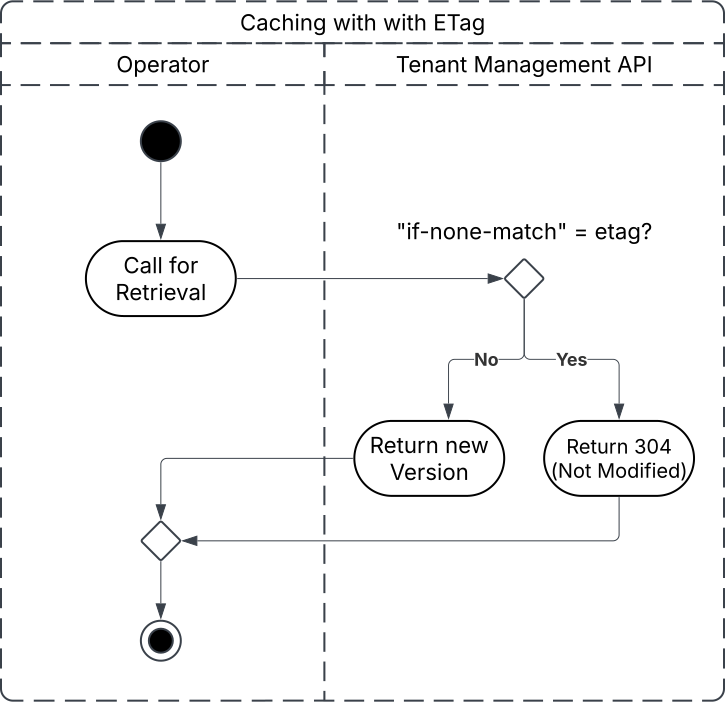
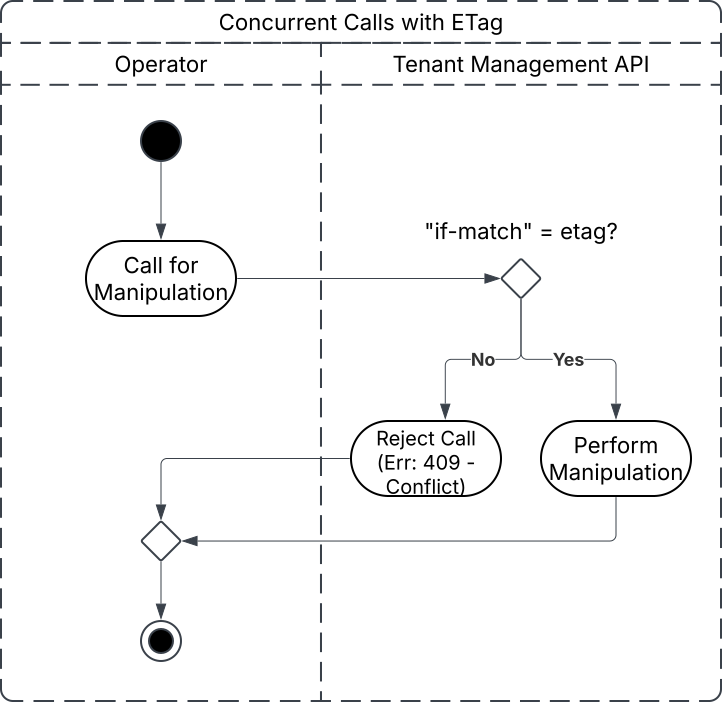
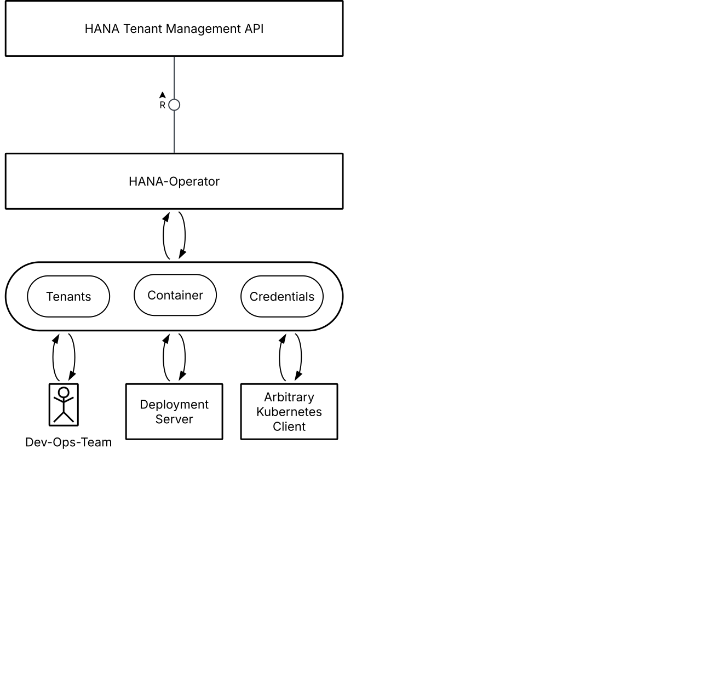
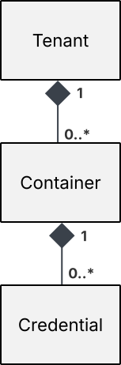

# Leveraging Hana Tenant Management Service API via SAP HANA Crossplane Provider

- Status: draft
- Deciders: Daniel Lou, Denes Csizmadia, Scott MacLean, Michael Leibel, Jan Pfenning
- Date: 2026-01-23
- Tags: hana, crossplane-provider, multi-tenancy

## Context

The SAP Crossplane Provider community requires a HANA Operator that enables Kubernetes-native provisioning and management of HANA resources. The HANA-MT API (v2.6.2) provides REST endpoints for managing tenants, containers, and credentials across the HANA multi-tenancy infrastructure.

### Key API Characteristics

**Async Operations:** Create, Update, Delete operations return HTTP 202 (Accepted) and are processed asynchronously. The Location header provides a polling URL to check status.

**ETag Support:** All GET responses include ETag headers for optimistic concurrency control. PUT/DELETE operations support If-Match headers to prevent concurrent modifications.

**$expand Parameter:** API supports detailed expansion:
- `$expand=containers` - fetch container details without credentials
- `$expand=containers/credentials` - full hierarchy (credentials only when single tenant returned)

**State Management:**
- Tenants have `status` field reflecting operation state
- Soft delete by default (14-day retention, `DELETED` state)
- Hard delete with `?immediate=true` parameter

**Hierarchical Path Structure:**
- `POST /tenants/v2/tenants` - create tenant
- `GET /tenants/v2/tenants/{tenantID}/containers/` - list containers
- `PUT /tenants/v2/tenants/{tenantID}/containers/{containerID}/credentials/{credentialID}` - create/update credential

**Concurrency:** Uses ETag + If-Match headers for optimistic locking. PUT operations are idempotent by design (create-or-update semantics).

#### Caching with ETag

By sending an ETag along with a GET Operation, bandwith can save be saved as the result will only be transmitted if the Entity actually changed on the Server Side. 



#### Concurrency with ETag

By sending the ETag along with an "unsafe" Method (a Method which alters the server state) we can ensure that the Version of an Entity we last encountered is still the same one on the Server once the Request actually reaches the Server preventing lost or dirty Updates. This mechanism prevents "last-in-wins" scenarios and data loss in high-concurrency environments, ensuring data integrity.



**Operations API:** Additional `/tenants/v2/operations` endpoint for long-running operations (move, copy, recovery) with detailed status tracking and state machine.

### Key Requirements
1. Provision HANA tenants, containers, and credentials via Kubernetes Custom Resources
2. Handle async operations with polling and status tracking
3. Implement optimistic concurrency control using ETags
4. Support soft/hard delete semantics
5. Mirror hierarchical REST API structure in CRDs
6. Support migration of existing tenants created outside the operator

### Business Drivers
- Consistency: Standardize HANA resource management across teams
- Automation: Reduce manual provisioning effort
- Infrastructure-as-Code: Enable GitOps and declarative deployments
- Community: Contribute operator as Inner Source to Crossplane ecosystem

## Decision



### 1.0 CRD Design Pattern

The HANA-MT Rest API follows the following Pattern:

**Resource Hierarchy:**
```
HanaTenant (aggregate root, parent)
  └── HanaContainer (0..*, child of Tenant)
       └── HanaCredentials (0..*, child of Container)
```

**CRDs to implement:**

- **HanaTenant** (Aggregate Root)
  - Represents the top-level HANA tenant resource
  - Spec: `guid` (optional), `apiCredentialsRef` (optional, defaults to `hana-mt-api-credentials`), `labels` (optional)
  - Annotations: `hana.sap.com/cascade-adopt: "true"` (optional, enables automatic child adoption)
  - Status: `phase` (Creating/Ready/Updating/Deleting), `containerRefs[]`, `conditions[]`
  - **Label Types:**
    - `metadata.labels` - Kubernetes labels for CR selection/filtering (e.g., `environment: prod`, `team: platform`)
    - `spec.labels` - Labels sent to HANA-MT API, stored in HANA system, used for API filtering and organization
  - **GUID behavior:**
    - If `guid` IS NOT set: Operator creates a new tenant via HANA-MT API and uses resulting GUID from the API
    - If `guid` IS set: Operator assumes a tenant with given GUID exists, fetches current state from API (adoption/migration scenario)
  - **Cascade Adoption:**
    - Without annotation: Operator fetches existing containers/credentials from API but does NOT create CRs (safe, explicit control)
    - With `cascade-adopt: "true"`: Operator automatically generates HanaContainer and HanaCredentials CRs for all existing children

- **HanaContainer** (Child of Tenant)
  - Models a HANA container within a tenant
  - Spec: `tenantRef` (reference to parent HanaTenant), `guid` (optional), `containerName` (string), `labels` (optional)
  - Status: `phase` (Creating/Ready/Updating/Deleting), `containerId`, `credentials[]`, `conditions[]`
  - **Label Types:**
    - `metadata.labels` - Kubernetes labels for CR selection/filtering (e.g., `tenant: production-tenant`, `tier: database`)
    - `spec.labels` - Labels sent to HANA-MT API, stored in HANA system, used for container filtering
  - **GUID behavior:**
    - If `guid` IS NOT set: Operator creates a new container via HANA-MT API and uses resulting GUID from the API
    - If `guid` IS set: Operator assumes that a Container with given GUID exists in referenced Tenant, fetches current state from API (adoption/migration scenario)
  
- **HanaCredential** (Child of Container)
  - Manages authentication credentials for a specific container
  - Spec: `containerRef` (reference to parent HanaContainer), `guid` (optional), `secretRef` (name of K8s Secret to create)
  - Status: `phase` (Creating/Ready/Updating/Deleting), `secretName`, `conditions[]`
  - **Label Types:**
    - `metadata.labels` - Kubernetes labels for CR selection/filtering (e.g., `container: prod-container-1`, `credentialType: admin`)
    - No `spec.labels` - Credentials are not labeled in HANA-MT API (identified by guid/credentialID)
  - User controls secret name via `secretRef` parameter in spec (e.g., "my-hana-prod-creds")
  - Operator creates/updates the specified K8s Secret with username/password in the namespace
  - Credential-Rotation: TBD

**Entity Relationship Diagram:**



### 1.1 CRD Type Definitions

This section formally defines the schema for each Custom Resource Type.

#### HanaTenant Type

**Purpose:** Aggregate root representing a HANA tenant in the HANA-MT system.

**API Version:** `hana.sap.com/v1`

**Metadata:**
- `name` (string): Kubernetes name for the tenant CR
- `namespace` (string): Kubernetes namespace where CR is created
- `labels` (map): Kubernetes labels for CR selection/filtering (e.g., `environment: prod`, `team: platform`)
  - User-defined, not sent to HANA-MT API
  - Used for Kubernetes resource selection, cross-cutting concerns
- `annotations` (map): Kubernetes annotations for CR behavior configuration
  - `hana.sap.com/cascade-adopt: "true"` - enable automatic child CR generation during adoption
  - `hana.sap.com/immediate-delete: "true"` - hard delete (permanent) instead of soft delete

**Spec (Provisioning Parameters):**
- `serviceInstanceID` (string, required): HANA Cloud service instance ID where tenant will be created
  - Must reference an existing service instance
  - API returns 400 Bad Request if invalid
- `dataEncryption` (object, optional): Data encryption configuration
  - `mode` (string, required if object present): Encryption mode
    - `DEDICATED_KEY` - SAP-generated tenant-dedicated key (default if not specified)
    - `MANAGED_KEY` - Customer-managed key (CMK) via KMS integration
  - If omitted: defaults to DEDICATED_KEY
- `labels` (array of strings, optional): HANA-MT API labels for tenant organization
  - Array of `key=value` format strings (e.g., `["cost-center=cc-12345", "department=infrastructure"]`)
  - Maximum 3 labels per tenant
  - Each key and value: max 64 bytes, alphanumeric + '-', '_', '.'
  - Case-sensitive
- `guid` (string, optional): GUID of existing tenant to adopt
  - If absent: operator creates new tenant via HANA-MT API and captures resulting GUID
  - If present: operator assumes tenant exists, fetches and adopts it (adoption/migration scenario)
- `apiCredentialsRef` (object, optional): Reference to K8s Secret containing HANA-MT API credentials
  - `name` (string): Secret name
  - `namespace` (string, optional): Secret namespace (defaults to CR namespace)
  - Secret format: `{clientId: string, clientSecret: string}` for OAuth2 client credentials flow
  - If omitted: defaults to `hana-mt-api-credentials` in same namespace

**Status (Operational State):**
- `phase` (string): Lifecycle phase
  - Values: `Creating` (initial), `Ready` (stable), `Updating`, `Deleting`, `FailedDelete`, `Failed`
- `guid` (string): HANA tenant GUID assigned by API (populated after creation)
- `observedGeneration` (integer): Generation of spec this status reflects (for stale detection)
- `etag` (string): ETag from latest API GET response (used for optimistic concurrency control)
- `containerRefs` (array of objects): List of child containers managed by operator
  - `name` (string): HanaContainer CR name
  - `guid` (string): HANA container GUID
  - Canonical inventory: populated in all modes (creation and adoption)
  - In explicit adoption mode: populated as user creates HanaContainer CRs
  - In cascade adoption mode: populated automatically as operator generates CRs for discovered containers
- `conditions` (array): Status conditions for detailed phase information
  - `type` (string): Condition category (e.g., `Ready`, `OperationInProgress`, `DeletionFailed`)
  - `status` (string): `True`, `False`, `Unknown`
  - `reason` (string): Machine-readable reason code
  - `message` (string): Human-readable message
  - `lastTransitionTime` (timestamp): When status last changed
- `createTimestamp` (timestamp): Tenant creation timestamp from API (RFC3339 format)
- `purgeTimestamp` (timestamp): When soft-deleted tenant will be permanently removed (only for DELETED state)

#### HanaContainer Type

**Purpose:** Child resource representing a HANA container (HDI or non-HDI schema) within a tenant.

**API Version:** `hana.sap.com/v1`

**Metadata:**
- `name` (string): Kubernetes name for the container CR
- `namespace` (string): Must match parent tenant namespace
- `labels` (map): Kubernetes labels for CR selection/filtering
  - Example: `tenant: production-tenant`, `tier: database`
- `annotations` (map): Kubernetes annotations (future use)

**Spec (Provisioning Parameters):**
- `tenantRef` (object, required): Reference to parent HanaTenant
  - `name` (string): Parent HanaTenant CR name
  - `namespace` (string, optional): Parent namespace (defaults to CR namespace)
  - Constraint: Parent must be in Ready phase
- `type` (string, required): Container type
  - `hdi` - HDI (HANA Deployment Infrastructure) container
  - `schema` - Standard database schema
  - Used when creating new container; preserved in adoption scenarios
- `containerName` (string, required): Human-readable name for container in HANA system
  - Must be unique within parent tenant
  - Example: `hdi-container-prod-01`
  - Used in API requests and HANA system UI
- `makeUniqueName` (boolean, optional): Whether to auto-append numerical suffix for uniqueness
  - If `true`: operator appends `_1`, `_2`, etc. to ensure uniqueness
  - Returned in response with actual unique name used
- `guid` (string, optional): GUID of existing container to adopt
  - If absent: operator creates new container via HANA-MT API
  - If present: operator adopts existing container from API (migration/adoption scenario)
- `sourceInstanceID` (string, optional): HANA service instance ID to copy container schema from
  - Used for creating container by reusing schema from another service instance
  - Operator fetches schema information and creates new container in target tenant
  - Alternative to `sourceContainerName` when service instance ID is known
- `sourceContainerName` (string, optional): Container name to copy schema from (when sourceInstanceID unavailable)
  - Used when customer doesn't have source service instance ID
  - `type` parameter determines which container type to reuse
- `labels` (array of strings, optional): HANA-MT API labels for container organization
  - Array of `key=value` format strings (e.g., `["workload=transactional", "region=eu-10"]`)
  - Maximum 3 labels per container
  - Each key and value: max 64 bytes, alphanumeric + '-', '_', '.'
  - Case-sensitive
  - Sent to HANA-MT API, stored in HANA system

**Status (Operational State):**
- `phase` (string): Lifecycle phase
  - Values: `Creating`, `Ready`, `Updating`, `Deleting`, `FailedDelete`, `Failed`
- `guid` (string): HANA container GUID assigned by API (populated after creation)
- `observedGeneration` (integer): Generation of spec this status reflects
- `etag` (string): ETag from latest API GET response (for optimistic concurrency)
- `credentialRefs` (array of objects): List of child credentials managed by operator
  - `name` (string): HanaCredential CR name
  - `guid` (string): HANA credential GUID
- `conditions` (array): Status conditions (same structure as HanaTenant)

#### HanaCredential Type

**Purpose:** Child resource managing authentication credentials (username/password) for a specific container.

**API Version:** `hana.sap.com/v1`

**Metadata:**
- `name` (string): Kubernetes name for the credentials CR
- `namespace` (string): Must match parent container namespace
- `labels` (map): Kubernetes labels for CR selection/filtering
  - Example: `container: prod-container-1`, `credentialType: admin`
- `annotations` (map): Kubernetes annotations (future use)

**Spec (Provisioning Parameters):**
- `containerRef` (object, required): Reference to parent HanaContainer
  - `name` (string): Parent HanaContainer CR name
  - `namespace` (string, optional): Parent namespace (defaults to CR namespace)
  - Constraint: Parent must be in Ready phase
- `guid` (string, optional): GUID of existing credential to adopt
  - If absent: operator creates new credential (username/password pair) via HANA-MT API
  - If present: operator adopts existing credential from API (adoption scenario)
- `secretRef` (object, optional): Reference to K8s Secret to create/update with credential data
  - `name` (string): Name of Secret to create/update in same namespace
  - Example: `my-hana-prod-admin`
  - If omitted: operator auto-generates Secret name based on credential GUID (e.g., `hana-credential-{guid}`)
  - If provided: operator uses specified name
  - Operator creates/updates the Secret with fields populated from API:
    - `username` (string): HANA user name (assigned by API)
    - `password` (string): HANA user password (assigned by API)
    - `host` (string): Hostname of the HDI container/schema
    - `port` (string): Port of the HDI container/schema
    - `url` (string): JDBC connection URL
    - `driver` (string): JDBC driver class name
    - `schema` (string): Schema name
    - `certificate` (string): Certificate chain for secure connections
    - `hdiUser` (string, HDI only): HDI admin username (for HDI containers)
    - `hdiPassword` (string, HDI only): HDI admin password (for HDI containers)
- `permissions` (array of strings, optional): Permission sets to assign to credential user
  - Only supported for HDI containers (`type: hdi`)
  - Currently accepts: `["development"]` only
- `roles` (array of strings, optional): Database roles to assign to credential user
  - Only supported for HDI containers
  - Example: `["READER", "WRITER"]`
- **Important:** No `spec.labels` field - credentials are not labeled in HANA-MT API (identified by GUID only)

**Status (Operational State):**
- `phase` (string): Lifecycle phase
  - Values: `Creating`, `Ready`, `Updating`, `Deleting`, `FailedDelete`, `Failed`
- `guid` (string): HANA credential GUID assigned by API (populated after creation)
- `observedGeneration` (integer): Generation of spec this status reflects
- `etag` (string): ETag from latest API GET response (for optimistic concurrency)
- `secretName` (string): Resolved Secret name (same as spec.secretRef.name when created)
- `conditions` (array): Status conditions (same structure as HanaTenant)

**Note:** Connection details (host, port, url, driver, certificate, etc.) are stored in the referenced K8s Secret, not duplicated in CR status. The CR acts as a lightweight wrapper managing credential lifecycle.

#### Common Fields Across All Types

**Standard Kubernetes Metadata:**
- All CRs include standard K8s metadata: `apiVersion`, `kind`, `metadata`, `spec`, `status`
- Finalizers: Operator adds `hana.sap.com/finalizer` to block deletion until cleanup completes

**ETag & Concurrency:**
- Status includes `etag` field (populated from latest API GET response)
- Used in subsequent PUT/DELETE requests via `If-Match` header for optimistic concurrency
- Stored in status to ensure operator has latest version before mutation

# TODO Create TAM Diagrams for etag handling

**Conditions Pattern:**
- All types use `.status.conditions[]` array for detailed status information
- Supports multiple condition types tracking different aspects (Ready, OperationInProgress, etc.)
- Enables rich monitoring and alerting on resource status

### 1.2 HANA-MT API Integration Patterns

**Async Processing with Polling:**
- All mutation operations (POST, PUT, DELETE) return HTTP 202 (Accepted)
- Location header provides polling URL: `GET {Location}`
- Operator must implement polling loop with exponential backoff
- Status field in response contains operation state: STARTING, PROCESSING, COMPLETED, FAILED
- Timeout handling: Some operations can take minutes; operator uses condition-based tracking

**ETag-Based Optimistic Concurrency:**
- All GET responses include ETag header (resource version identifier)
- PUT/DELETE should include `If-Match: <ETag>` header to prevent lost updates when multiple clients modify same resource
- Operator stores ETag in CRD status, retrieves before each update
- Conflict resolution: On 409 Conflict, re-fetch resource and retry with new ETag

**Idempotent Create-or-Update Semantics:**
- PUT operations are inherently idempotent (create if missing, update if exists)
- Operator leverages this: safe to retry PUT on network failure
- ETag prevents accidental overwrites of newer versions
- Returns 202 (accepted), 204 (no changes), or error - all safe to handle

**Hierarchical Query Parameters:**
- `$expand=containers` - includes container list without credential details
- `$expand=containers/credentials` - full hierarchy (available only for single-tenant queries)
- `$filter=hassubset(labels, [...])` - filter by container labels
- Operator uses expand strategically to minimize API calls

**Soft Delete with Retention:**
- Default DELETE: tenant enters soft-deleted state (DELETED status, 14-day retention)
- Hard DELETE: pass `?immediate=true` to permanently remove
- Operator must decide: support only hard delete or include recovery scenario?
- Status tracking: record deletion timestamp, allow 14-day window for recovery

**Additional Operations API:**
- `/tenants/v2/operations` endpoint for complex operations: move, copy, recovery
- Not directly needed for basic tenant/container/credential lifecycle
- Future: consider for multi-tenancy migration scenarios

### 2.0 API Integration Pattern

Synchronous reconciliation with async operation tracking via polling

**Reconciliation Model:**

1. **Desired State Detection:**
   - Operator watches CRs at each level (Tenant, Container, Credential)
   - Compares spec with current status

2. **API Call Execution:**
   - For create/update: send PUT request with If-Match ETag
   - For delete: send DELETE request with If-Match ETag, use `?immediate=true` for hard delete
   - Store Location header from 202 response in status

3. **Async Operation Polling:**
   - On 202 response: schedule polling coroutine
   - Poll GET {Location} every 5-10 seconds with exponential backoff
   - Track in Condition: `type: "OperationInProgress"`, `reason: "Polling"`
   - Update status with operation state from API: STARTING → PROCESSING → COMPLETED/FAILED
   - On terminal state: update Condition to Success/Failure, move phase accordingly

4. **ETag Refresh:**
   - Before each PUT/DELETE: fetch current resource to get latest ETag
   - Handle 304 Not Modified (no changes needed since last fetch)
   - On 409 Conflict: refresh ETag and retry PUT

5. **Tenant/Container/Credential Controllers:**
   - **Tenant Controller:** Reconciles HanaTenant → PUT/DELETE /tenants/{tenantID}
   - **Container Controller:** Reconciles HanaContainer → PUT/DELETE /tenants/{tenantID}/containers/{containerID}
   - **Credential Controller:** Reconciles HanaCredential → PUT/DELETE /tenants/{tenantID}/containers/{containerID}/credentials/{credentialID}

**Parent-Child Relationship Handling:**

- **Cascade Create:** Operator attempts to create child resources (Container, Credential) without pre-validation
  - API enforces constraints: rejects if parent tenant/container doesn't exist or is in invalid state
  - Operator reports API errors in CR status conditions (e.g., `type: Ready`, `status: False`, `reason: ParentNotReady`)
  - No need for operator to duplicate API validation logic
  - User receives clear error message describing the constraint violation

- **Cascade Delete - API-Enforced Ordering:**
  - **HANA-MT API Constraint:** DELETE tenant fails if containers exist; DELETE container fails if credentials exist
  - **Operator must enforce bottom-up deletion order:** Credentials → Containers → Tenant
  - **Implementation:**
    1. User deletes HanaTenant CR
    2. Finalizer on HanaTenant blocks deletion
    3. Tenant controller marks all HanaContainer CRs for deletion (sets deletionTimestamp)
    4. Container finalizers block deletion until all HanaCredential CRs deleted
    5. Container controller marks all HanaCredential CRs for deletion
    6. Credentials controller sends DELETE to API, polls until COMPLETED, removes finalizer
    7. Once all credentials removed, container controller sends DELETE to API, removes finalizer
    8. Once all containers removed, tenant controller sends DELETE to API, removes finalizer
  - **Error Handling:** If API rejects DELETE (children still exist):
    - Status: `FailedDelete` with error: "Cannot delete tenant: containers still exist"
    - Operator waits for child deletion to complete
    - Retries DELETE on next reconciliation loop
    - Prevents CR removal via finalizer until API confirms deletion

- **Orphan Prevention:** 
  - Finalizers on parent resources prevent deletion until children are cleaned up
  - API-level enforcement ensures no orphaned containers or credentials
  - If child CRs don't exist but API resources exist (unmanaged children), DELETE will fail with clear error message

### 3.0 Tenancy & Authentication Model

**Chosen Approach:** Multi-HANA support with flexible credential sourcing

**Design Details:**

- **Multi-HANA Environment:** Operator works across namespaces and potentially multiple HANA instances
  - Different tenants may be located in different HANA systems
  - Each Tenant must specify which credentials to use for API calls

- **Credential Secret Sourcing:**
  - Spec field: `apiCredentialsRef` (reference to K8s Secret containing HANA-MT API client credentials)
  - Secret format: `{clientId: "<client-id>", clientSecret: "<client-secret>"}` - OAuth2 client credentials
  - Operator performs OAuth2 client credentials flow to obtain access token before each API call
  - Token cached with TTL, refreshed before expiry
  - If not specified: fallback to default Secret name `hana-mt-api-credentials` in same namespace
  - Allows per-tenant API credential selection without duplicating CRDs

- **Data Credentials (Tenant Passwords):**
  - HanaCredential manages HANA database user passwords (not API credentials)
  - `secretRef` in HanaCredential spec: name of Secret to create/update with HANA user password
  - Operator manages creation/update of this Secret with username/password from API
  - Unrelated to API credentials

- **Secure Credential Handling:**
  - API credentials (HANA-MT authentication): read from Secret containing OAuth2 client credentials (clientId, clientSecret)
  - Operator performs OAuth2 client credentials flow: exchange client credentials for access token
  - Token cached in memory with TTL tracking, refreshed before expiry
  - Access token included in Authorization header for all API calls (`Authorization: Bearer <token>`)
  - Data passwords (HANA user access): stored in K8s Secrets, retrieved in Kubernetes Secret objects
  - Operator RBAC: minimal permissions to read API credential secrets, manage data credential secrets
  - Logging: mask sensitive fields (client secrets, tokens) in all log output

- **Hierarchy Enforcement:** 
  - Cannot create HanaContainer without valid tenantRef pointing to Ready Tenant
  - Cannot create HanaCredential without valid containerRef pointing to Ready Container

### 4.0 Soft Delete & Retention Strategy

**Chosen Approach:** Support both soft and hard delete with configurable behavior

**Implementation:**
- **Default:** Use soft delete (14-day retention period)
  - Operator marks Tenant CR with deletion timestamp
  - Sends DELETE without `?immediate=true`
  - Status shows `DELETED` phase
  - Allows recovery within 14 days (future enhancement)
  
- **Hard Delete:** Add annotation to CR: `hana.sap.com/immediate-delete: "true"`
  - Operator sends DELETE with `?immediate=true` parameter
  - Permanent removal, no recovery possible

- **Status Tracking:**
  - Add field: `deletionTimestamp` (when soft deletion initiated)
  - Add field: `recoveryDeadline` (14 days after deletion)
  - Condition: `type: "Deleting"`, tracks deletion status

**Deletion Failure Handling:**

**API-Enforced Hierarchy Constraints:**
- HANA-MT API rejects DELETE tenant if containers exist
- HANA-MT API rejects DELETE container if credentials exist
- Operator must delete in strict order: Credentials → Containers → Tenant

**Failure Scenarios:**

1. **Managed Children Exist:**
   - Normal case: Operator cascade-deletes children via finalizers
   - Finalizer ensures API DELETE only sent after all child CRs removed
   - Should not fail if operator logic is correct

2. **Unmanaged Children Exist (Out-of-Band Creation):**
   - If containers/credentials created manually (no CRs exist), parent DELETE fails
   - API returns error: "Cannot delete tenant: containers still exist"
   - Operator records error in Condition: `type: "DeletionFailed"`, `reason: "UnmanagedChildrenExist"`
   - Status phase: `FailedDelete` (prevents CR removal via finalizer)
   - Error message includes: list of unmanaged child GUIDs from API response
   - User must:
     - List children via API or kubectl plugin
     - Delete unmanaged children manually via HANA-MT API
     - Retry CR deletion (operator will attempt DELETE again)
     - Or remove finalizer to abandon deletion (leaves orphaned HANA resources)

3. **Race Condition (Manual Delete During Cascade):**
   - Operator deleting children, but user also deletes manually via API
   - Some children already deleted when operator tries to delete them
   - Operator handles 404 Not Found gracefully (already deleted = success)
   - Proceeds with parent deletion

### 5.0 Migration Strategy

**Chosen Approach:** Hybrid adoption strategy - explicit control with optional automation

**Adoption Modes:**

**Mode 1: Explicit (Default) - Safe, Gradual Migration**
- User creates HanaTenant CR with existing tenant's `guid` in spec
- **No cascade annotation** set
- Operator:
  1. Fetches existing tenant and all its containers/credentials from API
  2. Does NOT automatically create HanaContainer or HanaCredentials CRs
  3. Status phase: Creating → Adopted → Ready
- User then explicitly creates HanaContainer CRs with GUID for containers to adopt
- User explicitly creates HanaCredential CRs with GUID for credentials to adopt
- Enables fine-grained adoption: adopt only critical containers, leave others manual
- Supports gradual migration: adopt one container per deployment cycle

**Mode 2: Cascade (Optional) - Fast Full Adoption**
- User adds annotation to HanaTenant: `hana.sap.com/cascade-adopt: "true"`
- Operator:
  1. Fetches existing tenant and all containers/credentials from API
  2. Automatically generates HanaContainer CRs with GUID for each container
  3. Automatically generates HanaCredential CRs with GUID for each credential
  4. CRs created in same namespace with labels linking back to parent Tenant
  5. Status phase: Creating → Adopted → Ready
- One-shot adoption: all containers and credentials immediately managed
- All children transition to Ready phase once tenant is Ready
- Better for simpler deployments or teams comfortable with full automation

**Container/Credential Reconciliation**
- In both modes: once HanaContainer/HanaCredential CRs exist, operator:
  1. Fetches state with `$expand=credentials`
  2. Reconciles CR spec against API state using ETag-based concurrency
  3. Establishes bidirectional sync: CR state ↔ API state
  4. On conflict (409): log warning, defer update to next cycle

**Mixed Management Scenario** (Explicit Mode Only)
- Some containers managed by operator (HanaContainer CR exists)
- Other containers managed manually via API (no CR exists)
- Operator ignores unmanaged containers
- User can adopt more containers later by creating new CRs

**Adoption Decision Points:**
- **Tenant Level:** User decides when to adopt (no rush, safe coexistence)
- **Cascade Mode:** User chooses full automation (`cascade-adopt: "true"`) or explicit control (default)
- **Container Level (Explicit only):** User can adopt specific containers and leave others unmanaged
- **Credential Level (Explicit only):** User can adopt credentials for rotation, leave others unmanaged

## Alternatives Considered

### Adoption Strategy Alternatives

**Alternative 1: Full Cascade Adoption (Automatic)**
- When tenant with GUID is created, operator automatically generates all child CRs
- All containers and credentials immediately managed
- **Rejected because:** Loses user control, creates many CRs at once (overwhelming for large tenants), prevents selective/gradual adoption, cannot keep some resources unmanaged

**Alternative 2: Full Manual Adoption (Separate)**
- User must explicitly create every HanaContainer and HanaCredentials CR with GUID
- Complete control, no automation
- **Rejected because:** Too much manual work, slow migration process, error-prone (forgetting containers)

**Chosen: Hybrid Adoption (Configurable)**
- **Default:** Explicit adoption (safe, gradual, selective)
- **Opt-in:** Cascade adoption via annotation (fast for simple cases)
- Combines benefits: automation for teams that want it, control for teams that need it
- Supports mixed management: some containers automated, some manual
- Enables incremental adoption over time

## Example Custom Resources

### Example 1: New Tenant Creation (No GUID)

```yaml
apiVersion: hana.sap.com/v1
kind: HanaTenant
metadata:
  name: production-tenant
  namespace: hana-system
  # Kubernetes labels - for CR selection and management
  labels:
    environment: production
    team: platform
spec:
  # No guid - operator will create new tenant via HANA-MT API
  apiCredentialsRef:
    name: hana-api-prod
    namespace: hana-system
  # API labels - sent to HANA-MT API, stored in HANA system
  labels:
    cost-center: "cc-12345"
    department: "infrastructure"
    managed-by: "kubernetes"
status:
  phase: Creating
  guid: "550e8400-e29b-41d4-a716-446655440000"  # Extracted from Location header in 202 response
  conditions:
  - type: Ready
    status: "False"
    reason: CreatingTenant
    message: "Creating tenant via HANA-MT API"
```

### Example 2: Adopting Existing Tenant (With GUID)

```yaml
apiVersion: hana.sap.com/v1
kind: HanaTenant
metadata:
  name: legacy-tenant
  namespace: hana-system
  # Kubernetes labels
  labels:
    environment: production
    team: legacy-systems
    adoption-wave: "1"
spec:
  # GUID provided - operator will adopt existing tenant
  guid: "a1b2c3d4-e5f6-47a8-9b0c-1d2e3f4a5b6c"
  apiCredentialsRef:
    name: hana-api-prod
  # API labels - may differ from API's actual labels for existing tenant
  labels:
    cost-center: "cc-12345"
    department: "infrastructure"
status:
  phase: Ready
  guid: "a1b2c3d4-e5f6-47a8-9b0c-1d2e3f4a5b6c"
  # Inventory of containers managed by operator
  containerRefs: []
  conditions:
  - type: Ready
    status: "True"
    reason: Adopted
    message: "Tenant adopted successfully"
```

### Example 3: Adopting Existing Tenant with Cascade (Automatic Child Adoption)

```yaml
apiVersion: hana.sap.com/v1
kind: HanaTenant
metadata:
  name: auto-adopt-tenant
  namespace: hana-system
  # Kubernetes annotation (not sent to API)
  annotations:
    hana.sap.com/cascade-adopt: "true"  # Enable automatic child CR generation
  # Kubernetes labels
  labels:
    environment: staging
spec:
  guid: "e7f8a9b0-c1d2-43e4-c5f6-07a8b9cad0e2"
  apiCredentialsRef:
    name: hana-api-staging
  # API labels
  labels:
    cost-center: "cc-67890"
    environment: "staging"
status:
  phase: Ready
  guid: "e7f8a9b0-c1d2-43e4-c5f6-07a8b9cad0e2"
  # Operator automatically creates child CRs for discovered containers/credentials
  containerRefs:
  - name: "auto-adopt-container-1"
    guid: "c5d6e7f8-9a0b-41c2-a3d4-e5f6a7b8c9d0"
  - name: "auto-adopt-container-2"
    guid: "d6e7f8a9-0b1c-42d3-b4e5-f6a7b8c9d0e1"
  conditions:
  - type: Ready
    status: "True"
    reason: CascadeAdoptionCompleted
    message: "All containers and credentials adopted"
  - type: OperationInProgress
    status: "False"
```

### Example 4: New Container Creation

```yaml
apiVersion: hana.sap.com/v1
kind: HanaContainer
metadata:
  name: prod-container-1
  namespace: hana-system
  # Kubernetes labels
  labels:
    tenant: production-tenant
    tier: database
spec:
  # Reference to parent tenant
  tenantRef:
    name: production-tenant
    namespace: hana-system
  # No guid - operator will create new container
  containerName: "hdi-container-prod-01"
  # API labels - sent to HANA-MT API for container organization
  labels:
    tier: database
    workload: transactional
    region: "eu-10"
status:
  phase: Creating
  guid: "c5d6e7f8-9a0b-41c2-a3d4-e5f6a7b8c9d0"  # Extracted from Location header in 202 response
  credentialRefs: []
  conditions:
  - type: Ready
    status: "False"
    reason: CreatingContainer
    message: "Creating container in tenant"
  - type: OperationInProgress
    status: "True"
    reason: Polling
    operationId: "op-789xyz"  # Polling operation ID
```

### Example 5: Adopting Existing Container (With GUID)

```yaml
apiVersion: hana.sap.com/v1
kind: HanaContainer
metadata:
  name: legacy-container-prod-1
  namespace: hana-system
  # Kubernetes labels
  labels:
    tenant: legacy-tenant
    adoptionPhase: "1"
spec:
  tenantRef:
    name: legacy-tenant
    namespace: hana-system
  guid: "c5d6e7f8-9a0b-41c2-a3d4-e5f6a7b8c9d0"  # GUID of existing container
  containerName: "hdi-container-legacy-01"
  # API labels - what we're asserting for this container
  labels:
    tier: database
    workload: legacy
status:
  phase: Ready
  guid: "c5d6e7f8-9a0b-41c2-a3d4-e5f6a7b8c9d0"
  credentialRefs: []
  conditions:
  - type: Ready
    status: "True"
    reason: Ready
    message: "Container ready and operational"
```

### Example 6: Creating Credentials

```yaml
apiVersion: hana.sap.com/v1
kind: HanaCredential
metadata:
  name: prod-container-readonly-creds
  namespace: hana-system
  # Kubernetes labels
  labels:
    container: prod-container-1
    credentialType: readonly
    rotationEnabled: "false"
spec:
  containerRef:
    name: prod-container-1
    namespace: hana-system
  secretRef: "hana-prod-container-1-readonly"
  # No rotationPolicy - credentials managed manually
status:
  phase: Ready
  secretName: "hana-prod-container-1-readonly"
  conditions:
  - type: Ready
    status: "True"
    reason: Active
    message: "Read-only credentials ready"
```

### Example 7: Soft Delete (14-day Retention)

```yaml
apiVersion: hana.sap.com/v1
kind: HanaTenant
metadata:
  name: temporary-tenant
  namespace: hana-system
  # Kubernetes labels
  labels:
    environment: temporary
    status: deleting
spec:
  guid: ""
  apiCredentialsRef:
    name: hana-api-prod
  labels:
    temporary: "true"
status:
  phase: FailedDelete  # OR Deleting + DELETED after API confirms
  deletionTimestamp: "2026-01-31T15:00:00Z"
  recoveryDeadline: "2026-02-14T15:00:00Z"  # 14 days later
  conditions:
  - type: Deleting
    status: "True"
    reason: SoftDeleting
    message: "Tenant soft-deleted, recovery available until 2026-02-14"
```

### Example 8: Deletion Failure - Unmanaged Children Exist

```yaml
apiVersion: hana.sap.com/v1
kind: HanaTenant
metadata:
  name: tenant-with-unmanaged-children
  namespace: hana-system
  # Kubernetes labels
  labels:
    environment: production
    status: deletion-failed
spec:
  guid: "f8a9b0c1-d2e3-44f5-d6e7-18b9cadbe1f3"
  apiCredentialsRef:
    name: hana-api-prod
  labels:
    environment: production
status:
  phase: FailedDelete
  deletionTimestamp: "2026-01-31T15:00:00Z"
  conditions:
  - type: DeletionFailed
    status: "True"
    reason: UnmanagedChildrenExist
    message: "Cannot delete tenant: unmanaged containers exist"
    details: |
      Detected 2 unmanaged containers in tenant:
      - guid: d6e7f8a9-0b1c-42d3-b4e5-f6a7b8c9d0e1 (name: legacy-container-2)
      - guid: e7f8a9b0-c1d2-43e4-c5f6-07a8b9cad0e2 (name: legacy-container-3)
      Action: Delete these containers via HANA-MT API, then retry tenant deletion.
```

## References

- [Internal Tenant Management Service API Documentation](https://github.wdf.sap.corp/pages/DBaaS/tenant-management-service/?version=v2#/)
- [Tenant Management Service API in API Hub](https://api.sap.com/api/TenantAPI/overview)
- [Feature Scope of SAP HANA Crossplane Provider](https://github.tools.sap/cloud-orchestration/crossplane-provider-hana/blob/35a912f572429969028d5338fee343fcae5d86ec/docs/ADR/20251128-adr-provider-feature-scope.md#context-and-problem-statement)

### GitHub Issue

- [GitHub Issue/Feature](https://github.tools.sap/cloud-orchestration/crossplane-provider-hana/issues/200)
