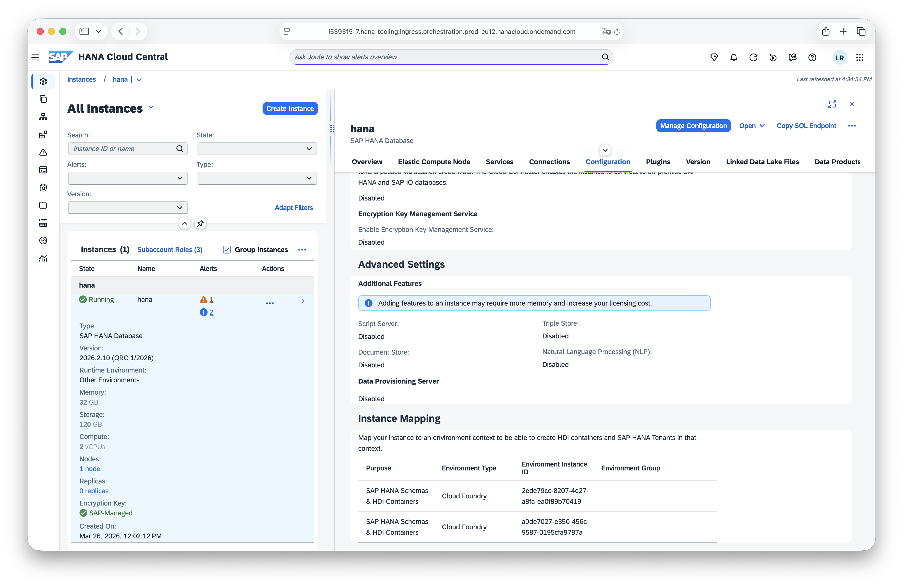

# Instance mapping

An instance mapping connects your SAP HANA Cloud database to an environment context (a Cloud Foundry org or space, or a Kyma cluster or namespace) so that applications in that context can create HDI containers or tenants in your database.

In this chapter, you'll learn how to manage those instance mappings declaratively using **Crossplane**.

:::tip Want to understand how it works under the hood?
Check out the [instance mapping architecture](/docs/crossplane-provider-hana/docs/contribution-notes/instance-mapping-architecture) for details.
:::

## 🚧 Prerequisites

- You've created a control plane.
- You've created a [HANA Cloud instance](/docs/crossplane-provider-hana/docs/end-user-guides/setup).
- You've setup the [HANA Provider](/docs/crossplane-provider-hana/docs/end-user-guides/setup#install-provider).
- Cloud Foundry: You've created an [org and space](/docs/crossplane-provider-cloudfoundry/docs/end-user-guides/configure-provider-cf#import-organization-).
- Kyma: _Coming soon ..._

## Get access to the admin API

Create an `Entitlement`, `ServiceInstance`, and `ServiceBinding` for the `hana-cloud` offering with plan `admin-api-access`.

```yaml title="hana-admin-api.yaml"
apiVersion: account.btp.sap.crossplane.io/v1alpha1
kind: Entitlement
metadata:
  name: hana-cloud-api-entitlement
spec:
  forProvider:
    serviceName: hana-cloud
    servicePlanName: admin-api-access
    servicePlanUniqueIdentifier: hana-cloud-admin-api-access
    enable: true
    subaccountRef:
      name: my-subaccount
---
apiVersion: account.btp.sap.crossplane.io/v1alpha1
kind: ServiceInstance
metadata:
  name: hana-api
spec:
  forProvider:
    name: hana-api
    offeringName: hana-cloud
    planName: admin-api-access
    serviceManagerRef:
      name: my-subaccount-service-manager
    subaccountRef:
      name: my-subaccount
    parameters:
      technicalUser: true
---
apiVersion: account.btp.sap.crossplane.io/v1alpha1
kind: ServiceBinding
metadata:
  name: hana-api-binding
spec:
  forProvider:
    name: hana-api-binding
    serviceInstanceRef:
      name: hana-api
    subaccountRef:
      name: my-subaccount
  writeConnectionSecretToRef:
    namespace: default
    name: hana-api-binding-secret
```

Apply the resources to your control plane:

```shell title="Run in terminal"
kubectl create -f hana-admin-api.yaml
```

The `ServiceBinding` creates the secret in a different format than the HANA provider expects. Until this is solved as part of [#88](https://github.com/SAP/crossplane-provider-hana/issues/88), create the secret manually.
Replace `<baseurl>` with the base URL and `<uaa>` with the UAA object from the secret created by the `ServiceBinding` above.

```yaml title="hana-api-secret.yaml" {8}
apiVersion: v1
kind: Secret
metadata:
  name: hana-api-secret
  namespace: default
type: Opaque
data:
  credentials: '{"baseurl":"","uaa":}'
```

Apply the secret to your control plane:

```shell title="Run in terminal"
kubectl create -f hana-api-secret.yaml
```

## Create an instance mapping (Cloud Foundry)

Begin by [installing kro](https://kro.run/docs/getting-started/Installation) in your control plane.

Next, create a `ResourceGraphDefinition` (RGD) for a Cloud Foundry HANA instance mapping.

```yaml title="cf-hana-instance-mapping-rgd.yaml"
apiVersion: kro.run/v1alpha1
kind: ResourceGraphDefinition
metadata:
  name: cf-hana-instance-mapping
spec:
  schema:
    apiVersion: v1alpha1
    kind: CfHanaInstanceMapping
    spec:
      serviceInstanceRef: string
      orgRef: string
      spaceRef: string
  resources:
    - id: serviceInstance
      externalRef:
        apiVersion: account.btp.sap.crossplane.io/v1alpha1
        kind: ServiceInstance
        metadata:
          name: ${schema.spec.serviceInstanceRef}
    - id: org
      externalRef:
        apiVersion: cloudfoundry.crossplane.io/v1alpha1
        kind: Organization
        metadata:
          name: ${schema.spec.orgRef}
    - id: space
      externalRef:
        apiVersion: cloudfoundry.crossplane.io/v1alpha1
        kind: Space
        metadata:
          name: ${schema.spec.spaceRef}
    - id: instanceMapping
      template:
        apiVersion: inventory.hana.orchestrate.cloud.sap/v1alpha1
        kind: InstanceMapping
        metadata:
          name: ${schema.metadata.name}
        spec:
          forProvider:
            platform: cloudfoundry
            serviceInstanceID: ${serviceInstance.status.atProvider.id}
            primaryID: ${org.status.atProvider.id}
            secondaryID: ${space.status.atProvider.id}
            adminCredentialsSecretRef:
              name: hana-api-secret
              namespace: default
              key: credentials
```

<button onClick={() => window.open("https://doc.crds.dev/github.com/SAP/crossplane-provider-hana/inventory.hana.orchestrate.cloud.sap/InstanceMapping/v1alpha1@v0.1.1", "_blank")} className='button button--secondary'>See full CRD reference</button>
<br/><br/>

:::tip Want to map to all spaces in an organization?
To map to all spaces in an organization instead of a specific space, omit the `spaceRef` from the schema and the `secondaryID` from the `InstanceMapping` template.
:::

Apply the RGD to your control plane:

```shell title="Run in terminal"
kubectl create -f cf-hana-instance-mapping-rgd.yaml
```

Finally, create a Cloud Foundry HANA instance mapping.

```yaml title="cf-hana-instance-mapping.yaml"
apiVersion: kro.run/v1alpha1
kind: CfHanaInstanceMapping
metadata:
  name: cf-hana-instance-mapping
spec:
  serviceInstanceRef: my-hana # name of BTP Provider ServiceInstance custom resource
  orgRef: my-org # name of CF Provider Organization custom resource
  spaceRef: my-space # name of CF Provider Space custom resource
```

Apply it to your control plane:

```shell title="Run in terminal"
kubectl create -f cf-hana-instance-mapping.yaml
```

Your SAP HANA Cloud database is now mapped to the Cloud Foundry space and applications in that space can create HDI containers in your database.

If you [have a subscription to SAP HANA Cloud Administration Tools](/docs/crossplane-provider-btp/docs/end-user-guides/services/create-services#subscription), you can verify the creation of the instance mapping in the configuration of your SAP HANA Cloud instance:



## Create an instance mapping (Kyma)

_Coming soon ..._

## ⁉ FAQs

No FAQs yet. Got a question? Reach out to us and help us build this section.
